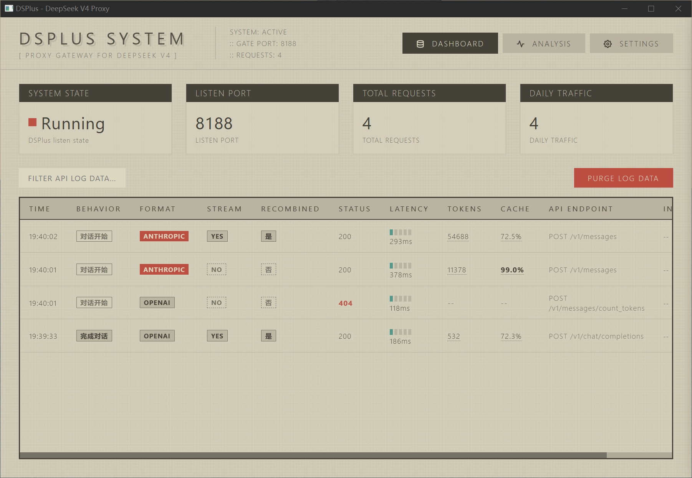
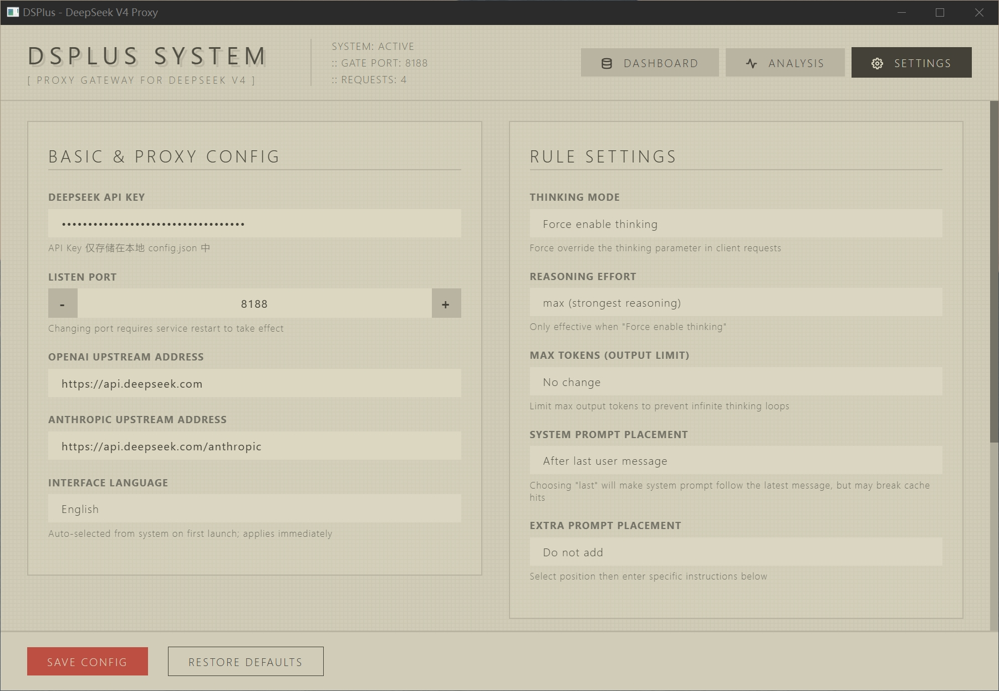
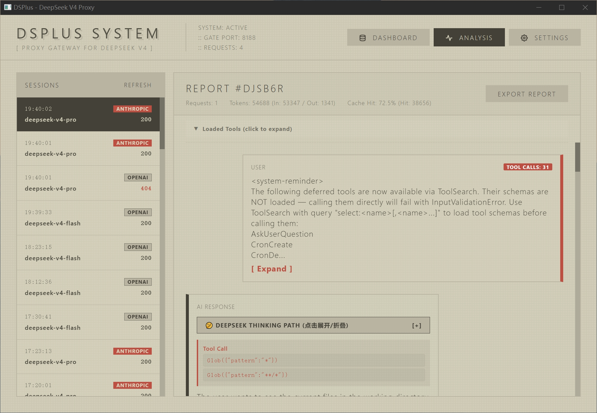
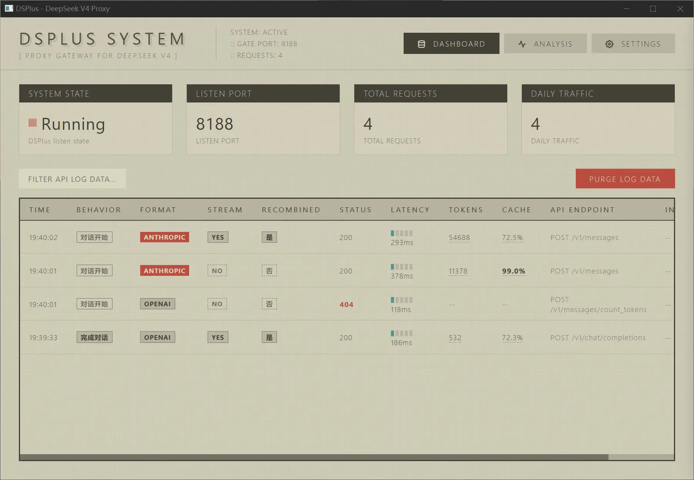

<div align="center">

# DSPlus

### 让 DeepSeek V4 发挥出真正的实力

**增强指令遵循，稳定长对话，减少幻觉、格式掉落、思维链混乱和工具调用假死**

<br>

<div align="center" markdown="1">

&#160;
&#160;
&#160;
&#160;
&#160;


</div>

<br>

[快速开始](#快速开始) · [解决的问题](#第二部分deepseek-v4-的典型问题与-dsplus-的解决方式) · [功能特点](#核心特点) · [技术文档](#第三部分技术文档) · [安全说明](#安全与隐私)

<br>
</div>

---

## 第一部分：一眼看懂 DSPlus

我非常喜欢 DeepSeek V4 系列。它价格足够低，能力足够强，已经成为我的主力模型。

但在真实使用中，尤其是长对话、角色扮演、复杂 Prompt、Coding Agent、工具调用和 CoT 推理场景里，它也会暴露出一些稳定性问题。

如果你也遇到过这些情况，DSPlus 可以给你带来一次明显的升级体验。

### 常见症状

| 指令遵循衰减 | 长对话退化 | 幻觉与逻辑偏差 |
|---|---|---|
| 格式掉落 | 输出变空 | 编造设定 |
| 禁令失效 | 重点丢失 | 时间线混乱 |
| 人设漂移 | 近况记错 | 因果倒置 |
| 字数失控 | 安全模式循环 | 数字判断错误 |

| CoT 混乱 | Coding Agent 异常 | 工具调用问题 |
|---|---|---|
| 正文进思维链 | 乱猜需求 | 工具调用失败 |
| 双思维链 | 忽略约束 | 陷入假死 |
| 英文 CoT | 空 content | 重复调用 |
| 视角错乱 | 不执行任务 | 卡在推理 |


### 一个被大量社区验证的解法

> 大量社区实践证明，有一个简单而有效的方法：**把系统提示词放到第一条消息后面**，可以显著防幻觉，并提升指令遵循度。
>
> 更进一步的方法是：每条消息后面都把系统提示词加上，但这会导致 Token 成本和对话结构混乱。
>
> DSPlus 找到了最佳方案：通过自动拼接，可以实现**只有最后一条消息**拼接系统提示词——既能节约 Token，又能保持对话结构。

### DSPlus 做什么

DSPlus 它是一个完全本地的中间层：

```text
你的客户端 / IDE / 前端工具
          ↓
       DSPlus
   本地 Prompt Guard 代理
          ↓
      DeepSeek V4 API
```

它的作用是让 DeepSeek V4 在复杂场景下更稳定：

- 更稳定地遵循 system prompt
- 更不容易丢格式、丢人设、丢禁令
- 长对话里更不容易退化成空洞短句
- CoT / reasoning_content / 正文边界更清晰
- Coding Agent 中更少空回复、假死和工具调用异常
- 推理过长或陷入循环时自动介入、分析、重试
- 对部分逻辑偏差提供可选的意图确认机制

### 核心特点

| 能力 | 简介 |
|---|---|
| Prompt Guard | 增强 system prompt、格式要求、角色设定、禁止事项的持续影响力 |
| 指令遵循增强 | 缓解多轮后规则衰减、格式掉落、禁令失效、人设漂移 |
| 长对话稳定 | 缓解长上下文后输出空洞、注意力涣散、近期记忆丢失 |
| CoT 稳定处理 | 减少 reasoning_content、正文、工具调用之间的边界混乱 |
| 空 content 修复 | 修复工具调用后 assistant content 为空，IDE 看不到回复的问题 |
| Anti-Loop | 检测过度推理、循环推理、输出截断，并自动分析重试 |
| 意图确认 | 实验性功能，用于缓解部分逻辑幻觉，但 Token 成本较高 |
| 本地 GUI | 可视化配置、请求日志、Token、缓存命中、重试和基础诊断 |

### 界面预览

> 截图位于 `images/`。部分 `.webp` 可能为动态演示。

<div align="center">

<table style="border-collapse:separate;border-spacing:5px;margin:0 auto">
  <tr>
    <td width="50%" align="center" style="padding:0"></td>
    <td width="50%" align="center" style="padding:0"></td>
  </tr>
  <tr>
    <td align="center" style="padding:0"><b>实时仪表盘</b></td>
    <td align="center" style="padding:0"><b>系统设置</b></td>
  </tr>
  <tr>
    <td width="50%" align="center" style="padding:0"></td>
    <td width="50%" align="center" style="padding:0"></td>
  </tr>
  <tr>
    <td align="center" style="padding:0"><b>基础诊断分析</b></td>
    <td align="center" style="padding:0"><b>Classic GitHub Dark 主题</b></td>
  </tr>
</table>

<br>

<table style="border-collapse:separate;border-spacing:5px;margin:0 auto">
  <tr>
    <td width="50%" align="center" style="padding:0"></td>
    <td width="50%" align="center" style="padding:0"></td>
  </tr>
  <tr>
    <td align="center" style="padding:0"><b>动态演示一</b></td>
    <td align="center" style="padding:0"><b>动态演示二</b></td>
  </tr>
</table>

</div>

### Before / After 对比

下面是 DSPlus 带来的**定性行为变化**。定量 benchmark 正在建设中（见 Roadmap）。

| 场景 | 不用 DSPlus | 用 DSPlus |
|---|---|---|
| 不支持的引用 / 事实请求 | 容易编造来源、论文、链接 | Prompt Guard 强化约束，减少无依据断言 |
| 长对话后 | 人设 / 设定漂移，输出变空变短 | 重组 system prompt，维持行为边界 |
| 工具调用后 | `content: ""`，IDE 看不到回复 | 空 content 自动回填，打断空回复循环 |
| Coding Agent | 忽略约束、重复调用、假死 | 阶段识别避免污染协议；Anti-Loop 重试 |
| 推理死循环 | 反复验证同一结论、被 max_tokens 截断 | Anti-Loop 捕获→分析→带指导语重试 |
| 逻辑漂移 | 把没说过的事当事实 | 意图确认（实验）输出前重新对齐 |

### 快速开始

> DSPlus 本质是一个本地 HTTP 代理，**不依赖 GUI 也能运行**，也**不需要任何预编译的 EXE**：它就是一个 Go 程序，可直接从源码运行，或自行编译成任意平台的可执行文件。GUI 只是同一端口上的一个可选 Web 仪表盘（详见[启动方式](#启动方式)）。

运行（任选其一）：

```batch
go run .                 # 直接运行源码，无需编译
go build -o dsplus .     # 编译为当前平台的可执行文件（Windows 为 dsplus.exe）
./dsplus                 # 运行编译后的二进制
```

默认地址：

```text
http://127.0.0.1:8188
```

然后在你的客户端里把 API Base URL 改成：

```text
http://127.0.0.1:8188
```

在 DSPlus 设置页填入 DeepSeek API Key 即可。

---

## 第二部分：DeepSeek V4 的典型问题与 DSPlus 的解决方式

DeepSeek V4 是一个能力很强、成本很低的模型。DSPlus 的设计目标不是否定它，而是把它在复杂真实场景里的高频稳定性问题，用本地代理层做增强。

### 1. 指令遵循能力差

这是最高频问题。

#### 典型表现

- 格式掉落
- 禁令失效
- 人设遗忘
- 字数不可控
- 多轮后规则衰减
- 首轮风格污染后续输出

#### DSPlus 的解决方式

DSPlus 会在请求进入 DeepSeek V4 前，对 system prompt 和额外规则进行重组，让关键约束更稳定地进入模型有效上下文。

支持三种策略：

| 策略 | 适合场景 |
|---|---|
| 第一条用户消息后 | 默认模式，兼顾稳定性与缓存命中 |
| 最后一条用户消息后 | 强调最新约束，适合短上下文或强控制场景 |
| 不修改 | 保持原始请求结构，只使用其他增强能力 |

同时支持额外高优先级 Prompt 注入，可用于：

- 固定输出格式
- 角色设定
- 禁止事项
- 全局行为准则
- 项目级规范
- Coding Agent 工作规则

### 2. 上下文与长对话退化

长对话是 DeepSeek V4 用户最常遇到的问题之一。

#### 典型表现

- 信息密度下降
- 输出变短变空
- 注意力涣散
- 近期记忆丢失
- 人设和设定漂移
- 进入刻板安全模式
- 第一轮输出惯性过强

#### DSPlus 的解决方式

DSPlus 不会突破模型本身的上下文限制，但会尽量降低长对话带来的行为漂移。

它会通过：

- 重组 system prompt
- 强化全局约束
- 控制 thinking 参数
- 控制 max_tokens
- 修复 CoT / content 边界
- 在异常推理时触发 Anti-Loop

来帮助 DeepSeek V4 在长上下文中维持更稳定的行为边界。

### 3. CoT / 思维链混乱

推理模型在工具调用、多轮历史和复杂客户端中，容易出现 reasoning_content 与正文边界混乱。

#### 典型表现

- 正文写进思维链
- 双思维链
- 英文 CoT
- 思维链幻觉
- 思维链视角错乱
- 客户端看不到正式回复

#### DSPlus 的解决方式

DSPlus 提供多项 CoT 相关修复：

| 功能 | 作用 |
|---|---|
| reasoning_content 自动补全 | 减少工具调用格式兼容问题 |
| 空 content 自动修复 | 把最近一条空 content 的 assistant 回复用 reasoning 回填 |
| thinking 模式控制 | 可选择不设置、强制关闭或强制开启 thinking |
| 重试 thinking 独立配置 | Anti-Loop 重试时可单独设置 thinking 与 effort |
| 流式捕获 | 捕获 reasoning / content，用于判断是否异常 |

空 content 修复对 Coding Agent 很重要。

一些 IDE 或 Agent 客户端不会展示 reasoning_content。如果历史中反复出现 `content: ""`，模型可能模仿这种模式，导致之后持续空回复。DSPlus 可以从请求侧打断这个反馈循环。

### 4. Coding Agent 与工具调用异常

在 Claude Code、OpenCode、OpenAI SDK、Anthropic 风格客户端等工具中，DeepSeek V4 的问题会更明显，因为这些场景对格式、工具调用、状态管理和指令遵循要求更高。

#### 典型表现

- 工具调用失败
- 工具回传后假死
- 多次重复调用同一工具
- 明明需要执行却一直分析
- 空 content 导致 IDE 无输出
- 乱猜文件、乱猜需求、忽略约束
- 工具调用后 CoT 和正文错位

#### DSPlus 的解决方式

DSPlus 会识别对话、工具调用、工具回传等不同阶段，尽量避免在工具回传阶段注入不该注入的内容，减少破坏客户端协议结构的风险。

同时通过：

- Prompt Guard
- empty content 修复
- reasoning_content 兼容
- Anti-Loop
- 请求日志与 Token 追踪

改善 Coding Agent 中的稳定性问题。

### 5. 幻觉与逻辑偏差

逻辑幻觉是更难的问题。DSPlus 当前对前三类问题，也就是指令遵循、长对话退化、CoT 混乱，优化更明显。

对于逻辑幻觉，DSPlus 提供实验性的意图确认机制。

#### 典型表现

- 编造设定
- 时间线混乱
- 因果倒置
- 数字判断错误
- 角色位置错误
- 把用户没说过的事当成事实

#### 意图确认机制

意图确认会在模型完成思考、准备输出正式回答前，重新注入最新用户意图，让模型在最终输出前再对齐一次当前问题。

它可能缓解：

- 跑题
- 上下文偏移
- 部分逻辑偏差
- 部分幻觉类错误

但它也有明显代价：

```text
Token 消耗可能接近翻倍。
```

所以它不是默认主推功能，更适合高准确性优先、可以接受成本上升的场景。

### 6. 防无限思考 Anti-Loop

DeepSeek V4 在复杂任务中，有时会长时间停留在推理阶段。

#### 典型表现

- 一直 reasoning，不输出正文
- 反复验证同一个结论
- 过度谨慎，不敢推进
- 输出被 length / max_tokens 截断
- Coding Agent 中一直分析，不执行任务

#### DSPlus 的解决方式

Anti-Loop 会：

1. 捕获流式或非流式响应。
2. 记录 reasoning、content 和 finish_reason。
3. 达到阈值或被截断时启动分析。
4. 判断是 loop、excessive 还是 normal。
5. 构造带指导语的重试请求。
6. 使用独立重试模型和 thinking 配置。
7. 如果再次超限，返回明确兜底提示。

---

## 第三部分：技术文档

这一部分面向专业用户、开发者和需要自行审计 / 部署 / 构建的人。

### 工作原理

DSPlus 是一个本地 HTTP 代理。它接收客户端请求，按配置进行增强后转发给 DeepSeek API。

```text
客户端请求
  ↓
格式检测
  ↓
语义阶段识别
  ↓
System Prompt 重组
  ↓
额外 Prompt 注入
  ↓
thinking / max_tokens 参数处理
  ↓
reasoning_content / empty content 修复
  ↓
转发 DeepSeek API
  ↓
流式捕获与日志记录
  ↓
可选 Anti-Loop / 意图确认 / 自动重试
  ↓
返回客户端
```

### 支持的接口风格

| 风格 | 识别方式 | 默认上游 |
|---|---|---|
| OpenAI 风格 | `messages` 数组、`role` 字段、`/chat/completions` 路径 | `https://api.deepseek.com` |
| Anthropic 风格 | 顶层 `system`、`/v1/messages`、兼容消息结构 | `https://api.deepseek.com/anthropic` |

DSPlus 会尽量透明透传未识别或无需修改的请求。

### 项目结构

```text
DSPlus/
├── main.go              # 程序入口、服务启动、重启、GUI 打开
├── config.go            # 配置结构、默认值、语言检测、安全读写
├── transform.go         # System Prompt 重组，支持 OpenAI / Anthropic 风格
├── proxy.go             # HTTP 代理核心，请求处理、参数注入、流式转发
├── retry.go             # Anti-Loop 分析、指导重试、重试请求构造
├── analysis.go          # 会话分析、Session / Turn 聚合、Markdown 导出
├── logger.go            # 实时日志、Token 统计、WebSocket 广播
├── trace.go             # 防循环追踪日志
├── gui.go               # Web GUI 和内部 REST API
├── gui_webview.go       # CGO 模式下的 WebView2 桌面窗口与托盘
├── gui_fallback.go      # 非 CGO 模式下浏览器回退
├── ws.go                # WebSocket 实时推送
├── web/
│   ├── index_v2.html    # 当前主界面
│   ├── app_v2.js        # 前端业务逻辑
│   ├── index_v2.css     # 主样式
│   ├── theme_yorha.css  # YoRHa 主题
│   ├── theme_classic.css# Classic 主题
│   ├── i18n.js          # 国际化逻辑
│   └── locales/         # zh / en 语言文件
├── docs/                # 设计文档、标准和问题记录
├── docs/images/         # README 截图与演示图
├── go.mod / go.sum      # Go 模块依赖
├── build.bat            # Windows 构建脚本
└── README.md            # 当前文档
```

### 启动方式

DSPlus 是 Go 编写的本地代理，**无需预编译 EXE、无需 GUI 也能作为代理运行**。GUI 只是同一端口（`http://127.0.0.1:8188/`）上的一个可选 Web 仪表盘，代理转发并不依赖它。

#### 从源码直接运行（无需 EXE）

```batch
go run .
```

#### 自行编译（任意平台）

```batch
go build -o dsplus .     # Windows 下生成 dsplus.exe
./dsplus                 # Linux / macOS
dsplus.exe               # Windows
```

> 仓库里的 `DSPlus.exe` 只是 Windows 上的一种预编译产物示例；你可在自己系统上用 `go build` 生成对应平台的可执行文件，命名随意。

#### 三种运行形态

| 形态 | 构建方式 | GUI 行为 | 适用场景 |
|---|---|---|---|
| 桌面 GUI（内嵌窗口） | `CGO_ENABLED=1 go build ...` | 自动打开 WebView2 窗口，关闭后最小化到托盘 | Windows 桌面，想要可视化配置 |
| 桌面 GUI（浏览器） | `CGO_ENABLED=0 go build ...` | 自动打开默认浏览器到仪表盘 | 无 CGO 编译环境，仍想要 GUI |
| 纯代理 / 无界面 | 同上，直接运行二进制 | GUI 仪表盘是同端口上的可选页面，**不打开也不影响代理转发**；在无图形界面的环境（服务器 / 容器）中，把它当透明代理用即可 | 服务器、CI、只想做中转 |

无论哪种形态，代理都在 `http://127.0.0.1:8188` 监听并转发请求；GUI 只是额外的可观测 / 配置入口。

### 快速开始

#### 1. 启动 DSPlus

```batch
dsplus                  # 或 dsplus.exe；也可直接 go run .
```

默认监听：

```text
http://127.0.0.1:8188
```

指定端口：

```batch
DSPlus.exe --port=9999
```

启动后会自动打开本地 GUI。

#### 2. 配置 DeepSeek API Key

打开 GUI，进入“系统设置”，填写 DeepSeek API Key。

API Key 只保存在本地 `config.json` 中。

#### 3. 修改客户端 Base URL

将客户端 API 地址改为：

```text
http://127.0.0.1:8188
```

实际请求会由 DSPlus 转发到 DeepSeek API。

### 客户端接入示例

#### OpenAI SDK / OpenAI 风格客户端

```python
from openai import OpenAI

client = OpenAI(
    api_key="any-value",
    base_url="http://127.0.0.1:8188"
)
```

#### Anthropic 风格客户端

```batch
set ANTHROPIC_BASE_URL=http://127.0.0.1:8188
set ANTHROPIC_AUTH_TOKEN=any-value
```

#### Cherry Studio / ChatBox / Open WebUI

在 API 设置中填写：

```text
API Base URL: http://127.0.0.1:8188
API Key: 任意值或客户端要求的占位值
```

DeepSeek API Key 在 DSPlus 设置页中配置。

### 主要配置项

配置文件位于 `DSPlus.exe` 同目录：

```text
config.json
```

| 字段 | 说明 |
|---|---|
| `api_key` | DeepSeek API Key，本地保存 |
| `port` | 本地监听端口，默认 8188 |
| `lan_access` | 是否允许局域网 / WSL 访问 |
| `openai_upstream` | OpenAI 风格上游地址 |
| `anthropic_upstream` | Anthropic 风格上游地址 |
| `language` | GUI 语言，支持 zh / en |
| `thinking_mode` | 不设置、强制关闭 thinking、强制开启 thinking |
| `reasoning_effort` | 推理强度，例如 high / max |
| `system_prompt_placement` | System Prompt 拼接位置，first / last / none |
| `extra_prompt` | 额外高优先级指令 |
| `extra_prompt_placement` | 额外 Prompt 注入位置，first / last / none |
| `max_tokens_mode` | 不修改、5000、32000、384000、不发送（删除参数）、自定义（上限 384000） |
| `max_tokens_custom` | 自定义 max_tokens 值 |
| `auto_reasoning_content` | 自动补全 reasoning_content |
| `auto_fix_empty_content` | 自动修复空 assistant content |
| `anti_loop_enabled` | 是否启用 Anti-Loop |
| `antiloop_retry_model` | Anti-Loop 重试模型 |
| `antiloop_retry_thinking` | 重试时是否启用 thinking |
| `antiloop_retry_effort` | 重试时推理强度 |
| `antiloop_check_tokens` | 主动检测推理循环阈值，0 表示仅依赖截断兜底 |
| `anti_hallucination_enabled` | 是否启用实验性意图确认 |
| `anti_hallucination_prompt` | 意图确认提示语模板 |
| `analysis_enabled` | 是否启用本地分析记录 |
| `analysis_retention_days` | 分析日志保留天数 |
| `verbose_logging` | 是否在实时日志中保留详细请求 / 响应内容 |
| `debug_mode` | 是否开启调试信息 |

### 本地 API 端点

DSPlus 单端口同时提供代理和 GUI 服务。

| 路径 | 用途 |
|---|---|
| `/chat/completions` | OpenAI 风格代理入口 |
| `/v1/chat/completions` | OpenAI 风格代理入口 |
| `/v1/messages` | Anthropic 风格代理入口 |
| 其他非 GUI 路径 | 尽量按格式透传到对应上游 |
| `/` | 本地 GUI 首页 |
| `/api/status` | 服务状态 |
| `/api/logs` | 实时请求日志，支持 `limit` / `offset` |
| `/api/logs/{id}` | 单条请求详情 |
| `/api/config` | 获取 / 保存配置 |
| `/api/restart` | 重启本地服务 |
| `/api/analysis/status` | 分析服务状态 |
| `/api/analysis/sessions` | 分析会话列表 |
| `/api/analysis/sessions/{id}` | 会话详情 |
| `/api/analysis/sessions/{id}/timeline` | 会话时间线分页 |
| `/api/analysis/sessions/{id}/export.md` | 导出 Markdown 诊断报告 |
| `/ws` | WebSocket 实时日志推送 |

### 构建

本项目使用 Go 开发。

#### 无 CGO 构建

无需安装 C 编译器，GUI 使用浏览器打开。

```batch
set CGO_ENABLED=0
go build -ldflags="-s -w" -o DSPlus.exe .
```

#### CGO 构建

需要可用的 C 编译环境，例如 MinGW。构建后支持 WebView2 内嵌窗口与托盘行为。

```batch
set CGO_ENABLED=1
go build -ldflags="-H windowsgui -s -w" -o DSPlus.exe .
```

#### 测试

```batch
go test ./...
```

指定测试：

```batch
go test -v -run TestTransformOpenAIInPlace ./...
```

### 安全与隐私

DSPlus 是本地代理，但它会处理你的完整请求与响应内容。请根据自己的隐私需求配置日志选项。

| 项目 | 说明 |
|---|---|
| API Key | 保存在本地 `config.json`，不要提交到公开仓库 |
| 请求内容 | 可能包含隐私、业务数据、代码或提示词 |
| verbose_logging | 开启后 GUI 请求详情会保留更完整的请求 / 响应内容 |
| analysis_enabled | 开启后会生成本地分析历史，用于会话查看和导出 |
| LAN Access | 开启后监听 `0.0.0.0`，仅建议在可信网络使用 |
| 日志文件 | 防循环追踪和分析历史可能写入本地文件，请定期清理 |

建议：

- 不提交 `config.json`
- 不公开日志文件和分析报告
- 不在不可信网络开启 LAN 访问
- 分享截图前检查是否包含 API Key、私有代码、客户信息或私有 Prompt

### 透明性与可审计性

DSPlus 的核心逻辑集中在少量 Go 文件中，便于审计。

| 能力 | 主要文件 |
|---|---|
| System Prompt 重组 | `transform.go` |
| 请求代理与参数注入 | `proxy.go` |
| Anti-Loop 与重试 | `retry.go` |
| 配置与默认值 | `config.go` |
| 日志与实时更新 | `logger.go`、`ws.go` |
| 会话分析与导出 | `analysis.go` |
| GUI 与内部 API | `gui.go`、`web/` |

你可以直接阅读这些文件，确认 DSPlus 做了什么、没有做什么。

### 当前边界

- DSPlus 不会替代 DeepSeek V4。
- DSPlus 不会突破模型本身的上下文窗口。
- DSPlus 不联网做事实核查。
- DSPlus 不保证完全消除幻觉。
- 意图确认仍在测试中，可能显著增加 Token 消耗。
- Anti-Loop 会额外产生分析和重试请求，可能增加延迟与成本。
- 基础诊断分析当前主要用于本地排查，不作为智能诊断系统宣传。

### Roadmap

计划中的方向：

- 更成熟的意图确认策略
- 降低意图确认的 Token 成本
- 更强的逻辑偏差缓解能力
- 面向 Agent / Workflow 的智能诊断分析
- 自动分析各阶段耗时占比
- Token 分布分析与成本定位
- 更多客户端接入文档
- 更多 Before / After 案例

### 常见问题 FAQ

**DSPlus 能彻底解决 DeepSeek V4 幻觉吗？**

不能。DSPlus 的目标是降低幻觉概率，而不是保证 DeepSeek V4 永远不出错。它主要通过 prompt 结构优化、system prompt 增强、证据约束和 anti-loop 机制减少胡编乱造。

**DSPlus 如何降低 DeepSeek V4 幻觉？**

DSPlus 是一个本地 API 代理。它重组请求结构、增强 system prompt 遵循、加入防幻觉护栏，并在检测到思维循环时重试不稳定的回复。

**DSPlus 适合 SillyTavern / 角色扮演吗？**

适合。DSPlus 可以帮助减少角色设定漂移、长上下文后乱编设定，以及重复输出等问题。

**DSPlus 适合 coding agent 吗？**

适合。DSPlus 可以帮助 coding agent 更稳定地遵守 system prompt，减少无依据假设和长任务中的指令漂移。

**DSPlus 会联网做事实核查吗？**

不会。DSPlus 是本地代理，不联网做事实核查。

**Token 成本怎么样？**

大部分功能开销很小。意图确认（实验性功能）可能使 Token 消耗接近翻倍，因此默认关闭。

**我的 API Key 存在哪里？**

保存在 `DSPlus.exe` 同目录的本地 `config.json` 中。请不要提交到公开仓库。

### License

请以仓库实际 License 文件为准。如果你准备公开发布，建议补充明确的开源许可证。
